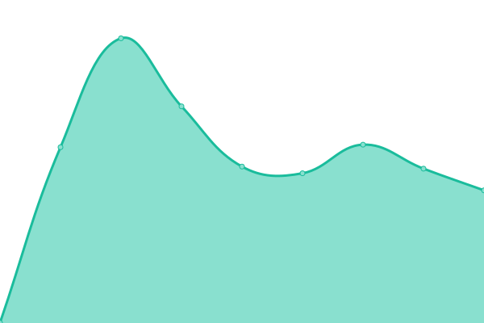
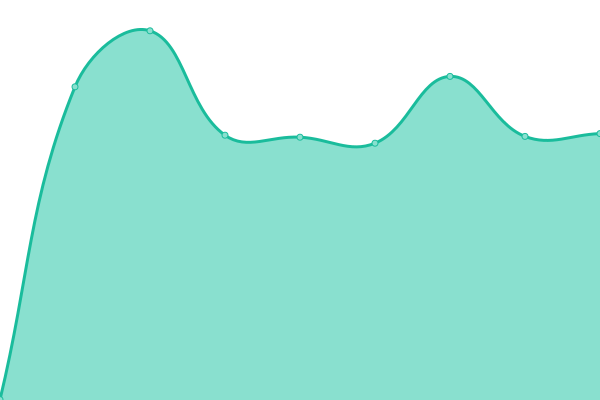
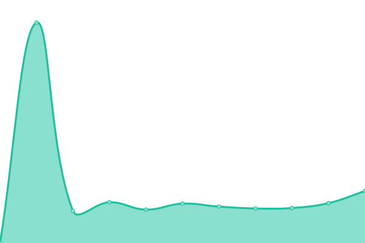

# [📈 Live Status](https://status.picoscratch.de): <!--live status--> **🟧 Partial outage**

This repository contains the open-source uptime monitor and status page for [PicoScratch](https://www.picoscratch.de), powered by [Upptime](https://github.com/upptime/upptime).

With [Upptime](https://upptime.js.org), you can get your own unlimited and free uptime monitor and status page, powered entirely by a GitHub repository. We use [Issues](https://github.com/picoscratch/upptime/issues) as incident reports, [Actions](https://github.com/picoscratch/upptime/actions) as uptime monitors, and [Pages](https://status.picoscratch.de) for the status page.

<!--start: status pages-->
<!-- This summary is generated by Upptime (https://github.com/upptime/upptime) -->
<!-- Do not edit this manually, your changes will be overwritten -->
<!-- prettier-ignore -->
| URL | Status | History | Response Time | Uptime |
| --- | ------ | ------- | ------------- | ------ |
|  [PicoScratch Homepage](https://www.picoscratch.de) | 🟩 Up | [pico-scratch-homepage.yml](https://github.com/picoscratch/upptime/commits/HEAD/history/pico-scratch-homepage.yml) | 

 859ms
     
 | 

<a href="https://status.picoscratch.de/history/pico-scratch-homepage">99.72%</a>
    

|  [PicoScratch MINT Manager](https://mint.picoscratch.de) | 🟩 Up | [pico-scratch-mint-manager.yml](https://github.com/picoscratch/upptime/commits/HEAD/history/pico-scratch-mint-manager.yml) | 

 746ms
     
 | 

<a href="https://status.picoscratch.de/history/pico-scratch-mint-manager">99.72%</a>
    

|  [PicoScratch MINT Server](https://mintsrv.picoscratch.de) | 🟥 Down | [pico-scratch-mint-server.yml](https://github.com/picoscratch/upptime/commits/HEAD/history/pico-scratch-mint-server.yml) | 

 687ms
     
 | 

<a href="https://status.picoscratch.de/history/pico-scratch-mint-server">7.18%</a>
    

|  [PicoScratch Learn Manager](https://manager.picoscratch.de) | 🟩 Up | [pico-scratch-learn-manager.yml](https://github.com/picoscratch/upptime/commits/HEAD/history/pico-scratch-learn-manager.yml) | 

 651ms
     
 | 

<a href="https://status.picoscratch.de/history/pico-scratch-learn-manager">99.72%</a>
    

|  [PicoScratch Learn Server](https://server.picoscratch.de) | 🟥 Down | [pico-scratch-learn-server.yml](https://github.com/picoscratch/upptime/commits/HEAD/history/pico-scratch-learn-server.yml) | 

 673ms
     
 | 

<a href="https://status.picoscratch.de/history/pico-scratch-learn-server">0.00%</a>
    

<!--end: status pages-->

[**Visit our status website →**](https://status.picoscratch.de)

## 📄 License

- Powered by: [Upptime](https://github.com/upptime/upptime)
- Code: [MIT](./LICENSE) © [Anand Chowdhary](https://anandchowdhary.com), supported by [Pabio](https://pabio.com)
- Data in the `./history` directory: [Open Database License](https://opendatacommons.org/licenses/odbl/1-0/)
